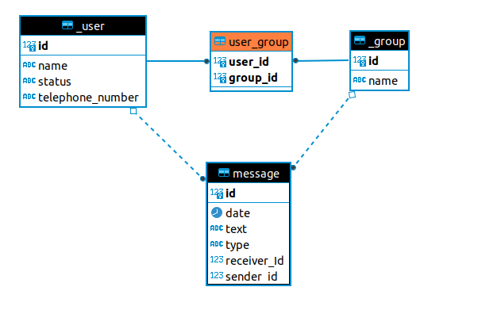

# Xcale Test
## _Evaluación técnica para Carlos Escalona por parte de Xcale_
-------------------------------------------------------------------
### Tecnologías usadas:
- Java 11
- Spring Boot 2.7.9
- Base de Datos en memoria H2
- Lombok
- Junit 5

-------------------------------------------------------------------

## Instalación/Ejecución
- Descargar y ejecutar el proyecto este corre en el puerto por defecto 8080.
- La base de datos está en memoria por lo tanto no es necesario configurar una conexión.
- Al momento de correr el proyecto se crea la Base de Datos.
- En caso que necesite acceder a la BD puede hacerlo por la siguiente url (http://localhost:8080/h2-console/) con los siguientes parametros:
  * Driver Class:  org.h2.Driver 
  * JDBC URL: jdbc:h2:mem:devdb 
  * User Name: sa 
  * Password:  password 
- Existe un script que cargara las tablas necesarias (usuarios, grupos, grupo_usuarios) para probar el sistema.
- El acceso a la documentación de los servicios rest del proyecto está en (http://localhost:8080/swagger-ui.html#/)
-------------------------------------------------------------------

## Funcionamiento
El sistema se enfoca principalmente en un servicio que es el de enviar mensajes (http://localhost:8080/api/v1/whatsapp/send-message) para ello se debe de cargar el payload con la respectiva data:
`{"groupId": 1,
"senderId": 1,
"text": "mensaje",
"type": "TEXT"}`

###### groupId: Es el id del grupo a donde será enviado el mensaje para efectos practicos siempre se usara el id 1
###### senderId: Es el id del usaurio emisor del mensaje se puede usar los Id de 1 a 10 que ya están registrados en la BD.
###### text: Es un texto cualquiera que puede contener el mensaje.
###### type: Es el tipo de mensaje que se va a enviar se puede escoger entre los valores TEXT, VOICE, DOCUMENT aunque para efectos practicos no tendra relevancia en este proyecto el tipo de mensaje.  

-------------------------------------------------------------------

  El proceso de envio de mensajes consiste en que al momento del envio este se almacenara en la tabla MESSAGE de la BD, para luego buscar todos los usuarios del grupo al que va dirigido el mensaje, sin incluir al remitente, y simular una notificacion a cada uno de estos usuarios. La idea que tenía para las notificaciones era implementar un patron observador o la implementación de una cola de mensajería pero por cuestiones de tiempo no alcance a desarrollarlo pero la idea es esa. A traves de la consola se puede ver las notificaciones que tienen cada uno de los usarios pertenecientes al grupo.

[PlDb]: <https://github.com/joemccann/dillinger/tree/master/plugins/dropbox/README.md>
[PlGh]: <https://github.com/joemccann/dillinger/tree/master/plugins/github/README.md>
[PlGd]: <https://github.com/joemccann/dillinger/tree/master/plugins/googledrive/README.md>
[PlOd]: <https://github.com/joemccann/dillinger/tree/master/plugins/onedrive/README.md>
[PlMe]: <https://github.com/joemccann/dillinger/tree/master/plugins/medium/README.md>
[PlGa]: <https://github.com/RahulHP/dillinger/blob/master/plugins/googleanalytics/README.md>

-------------------------------------------------------------------

## Documentación

### Modelo Entidad Relación (BD) 

### Diagrama de Clases

